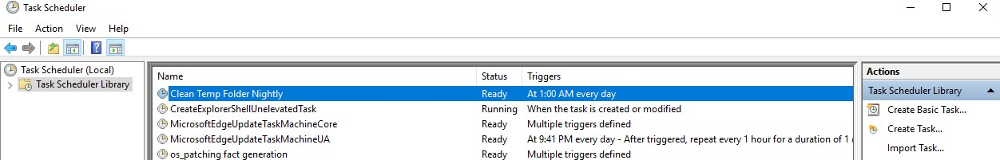
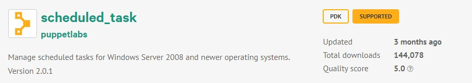

# Managing Windows Power Settings

In this section we will configure a Windows scheduled task. In this particular case, we'll use the example of setting a nightly task on the server to clean out the temp directory.

## Exercise

  1. Open `plans/baseline/windows.pp` in Visual Studio Code. We will be building our baseline by uncommenting existing code blocks here.

  2. Uncomment lines 23-31. Puppet DSL allows you to keep comments in your code using `#` at the beginning of the line, so as you can see I've given a description of what this registry key will manage and a link to the supporting documentation for managing registry keys.

  3. Save windows.pp. If the vscode puppet plugin detects any errors, please read and resolve them before continuing.

  4. From your powershell prompt in the repo root directory, run `bolt plan run wsp::baseline::windows -t windows`
  
  5. We should see the changed items in the summary report.

  Now, let's validate the scheduled tasks has been created. Using Remote Desktop, connect to one of your configured systems and open Task Scheduler. You should see a task called `Clean Temp Folder Nightly` has now been added.

  

  ## Wrap Up

  In this section we were able to use a puppet resource to manage Windows scheduled task settings. This module is in the *puppetlabs* namespace, which means it was developed by our internal teams. A number of the modules in the *puppetlabs* namespace will also have a supported badge:

  

  This means that as a Puppet Enterprise customer you can receive support on any issues related to that module, wether you are using it through Bolt Plans or as a Puppet profile.